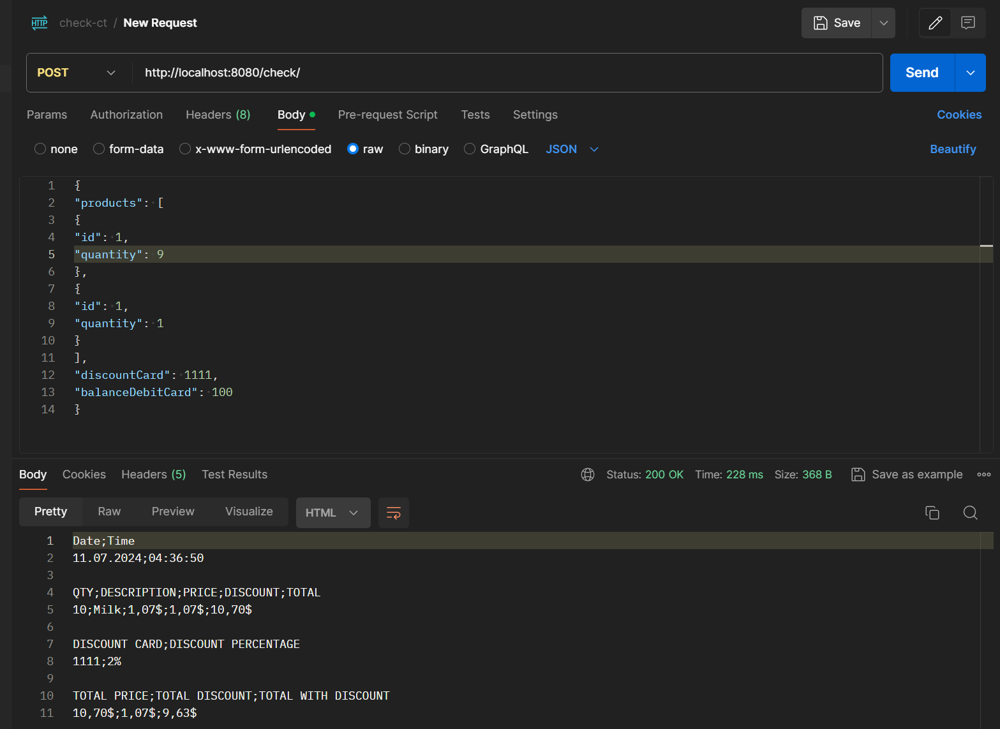

# Task 4

## Technologies
- java 21
- postgresql
- junit 5
- mockito
- Tomcat 10

### Examples
 ### Check

- http://localhost:8080/check/

 ### Product

```json
{
"products": [
{
"id": 1,
"quantity": 9
},
{
"id": 1,
"quantity": 1
}
],
"discountCard": 1111,
"balanceDebitCard": 100
}
```

- [Get] http://localhost:8080/check/products?id=1

- [Post] http://localhost:8080/check/products
```json
{
"description": "Eat 100g.",
"price": 3.25,
"quantity": 5,
"isWholesale": true
}
```

- [Put] http://localhost:8080/check/products?id=6
```json
{
"description": "Chocolate Ritter sport 100g.",
"price": 3.25,
"quantity": 5,
"isWholesale": true
}
```

- [Delete] http://localhost:8080/check/products?id=6
 
 ### Discountcard

- [Get|Delete] http://localhost:8080/check/discountcards?id=1

- [Post] http://localhost:8080/check/discountcards
```json
{
"discountCard": 5265,
"discountAmount": 2
}
```

- [Put] http://localhost:8080/check/discountcards?id=5
```json
{
"discountCard": 5555,
"discountAmount": 3
}
```
